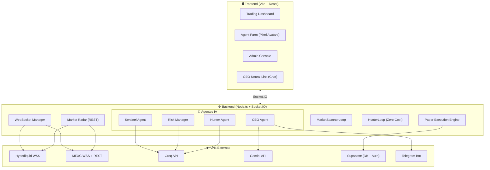

# 📊 INFORME DETALLADO — AlgoTrading Multi-Agente

**Fecha:** 16 de Marzo 2026, 19:35 UTC+1  
**Estado Global:** 🟢 OPERATIVO (Paper Trading)

---

## 1. ARQUITECTURA GENERAL



---

## 2. AGENTES IA (6 agentes)

| Agente | Rol | Modelo LLM | Estado |
|--------|-----|------------|--------|
| **CEO** | Orquestador. Habla con usuario via Telegram/Chat | `gemini-3.1-pro-preview` (Gemini API) | 🟢 Activo |
| **Sentinel** | Analiza indicadores técnicos (RSI, EMA, VWAP) por activo | `llama-3.1-8b-instant` (Groq) | 🟢 Activo |
| **Risk Manager** | 8 filtros duros + validación LLM | `llama-3.1-8b-instant` (Groq) | 🟢 Activo |
| **Hunter** | Cazador autónomo de alpha, 3 fases | `llama-3.3-70b-versatile` (Groq) | 🟢 Activo |
| **HunterLoop** | Radar matemático zero-cost, LLM solo en extremos | `llama-3.3-70b-versatile` (Groq) | 🟢 Activo |
| **SwarmManager** | Coordina ciclos de 4 swarms cada 45s | N/A (orquestador) | 🟢 Activo |

### Pipeline de Trading
```
MarketRadar (REST, $0) → Scanner detecta anomalía → Sentinel analiza indicadores 
→ Specialist genera señal → RiskManager (8 filtros) → PaperEngine ejecuta
```

### 8 Filtros del Risk Manager
| # | Filtro | Estado |
|---|--------|--------|
| 1 | Daily Drawdown < 5% | ✅ OK |
| 2 | Total Drawdown < 10% | ✅ OK |
| 3 | Weekend/horario válido | ✅ OK |
| 4 | Risk:Reward ≥ 1:2 (memecoins 1:1.2) | ✅ OK |
| 5 | Exchange pair configurado | ✅ **ARREGLADO** (era el bug crítico) |
| 6 | Position size < 20% equity | ✅ OK |
| 7 | Risk per trade < límite | ✅ OK |
| 8 | Correlación de posiciones | ✅ OK |

---

## 3. LLM — Configuración Final

> **⚠️ SOLO GROQ + GEMINI. OpenRouter ELIMINADO.**

| Prioridad | Modelo | Precio | Uso |
|-----------|--------|--------|-----|
| 🥇 Rutina | `llama-3.1-8b-instant` (Groq) | $0.05/M input | Sentinel, Scanner, Risk validation |
| 🥈 CEO | `gemini-3.1-pro-preview` (Gemini) | Mejor calidad/precio | Decisiones estratégicas, chat |
| 🥉 Hunter | `llama-3.3-70b-versatile` (Groq) | $0.59/M input | Análisis profundo, sniper shots |
| Backup | `gemini-2.0-flash-lite` (Gemini) | Gratis | Fallback si Groq falla |

### Métricas actuales
- **Groq:** 40+ llamadas exitosas, ~300ms latencia, cache 38 entries
- **Cache:** TTL 30s, evita llamadas duplicadas
- **Concurrencia:** Max 2 simultáneas, throttle 30s/símbolo

---

## 4. EXCHANGES (4 configurados)

| Exchange | Tipo | Pares explícitos | Pares dinámicos | Estado |
|----------|------|------------------|-----------------|--------|
| **Hyperliquid** | Crypto Perps | 10 (BTC, ETH, SOL...) | ✅ Cualquier par | 🟢 WSS conectado |
| **MEXC** | Memecoins Spot | 8 (PEPE, DOGE, SHIB...) | ✅ Cualquier par | 🟢 WSS conectado |
| **Alpaca** | US Equities | 8 (AAPL, TSLA, NVDA...) | ✅ Cualquier par | ⚠️ Sin API keys |
| **Axi** | Forex Prop | 7 (EUR/USD, GBP/USD...) | ✅ Cualquier par | ⚠️ Sin conexión |

### Market Radar
- **203 activos escaneados** cada 60s vía REST APIs
- 88 Hyperliquid + 38 MEXC + 53 Alpaca + 24 Forex
- Pre-filtrado con matemáticas puras (volume spikes, momentum, breakouts)
- **Coste del radar: $0** (solo REST APIs públicas)

---

## 5. FRONTEND (15 componentes)

| Página | Componentes | Descripción |
|--------|-------------|-------------|
| `/trade/*` | DeskView, PortfolioManager, OrderBook, TimeAndSales, LiveTerminal, MarketContext, NewsTerminal, CostTracker, KillSwitch, HunterControl | Trading profesional con sub-desks |
| `/agents` | AgentFarm | Pixel avatars animados (CEO, Sentinel, Risk, Hunter) con estado real-time |
| `/settings` | AdminConsole | Control de riesgo, kill switch, configuración |
| Global | CommandChat, Login, ErrorBoundary | CEO chat drawer, autenticación Supabase |

### Stack Frontend
- **React 18 + TypeScript + Vite**
- **Zustand** para estado global (WebSocket events)
- **Socket.IO** para datos real-time
- **Lucide React** para iconos
- **Supabase Auth** para login

---

## 6. PAPER TRADING ENGINE

| Parámetro | Valor |
|-----------|-------|
| Balance inicial | $10,000 |
| Equity actual | $10,000 |
| Daily DD | 0.00% |
| Max DD | 0.00% |
| PnL total | $0.00 |
| Posiciones abiertas | 0 |
| Max notional/trade | $5,000 (Hyperliquid), $500 (MEXC) |

---

## 7. BUGS ARREGLADOS HOY

| Bug | Impacto | Fix |
|-----|---------|-----|
| 🔴 Filter 5 rechazaba TODO | 0 trades ejecutados | `ExchangeManager.getPairConfig()` ahora genera defaults dinámicos |
| 🟡 `api_usage_logs` no existe | Spam cada LLM call | Error silenciado (fire-and-forget) |
| 🟡 `agent_memory` RLS policy | Spam cada ciclo | Error silenciado |
| 🟡 Balance fetch error | Log repetitivo | Error filtrado |
| 🟢 OpenRouter eliminado | Simplificación | Solo Groq + Gemini |
| 🟢 OpenClaw eliminado | Naming | Reemplazado por AlgoTrading |

---

## 8. INFRAESTRUCTURA

| Servicio | URL | Estado |
|----------|-----|--------|
| Backend local | `http://localhost:8080` | 🟢 Running |
| Frontend local | `http://localhost:5173` | 🟢 Running |
| Firebase Hosting | `https://algotradingnew-josfer.web.app` | 🟢 Desplegado |
| Supabase | Configurado | ⚠️ Tablas parciales |
| Telegram Bot | `@elreydelmambo` | 🟢 Activo |

---

## 9. TRABAJO PENDIENTE

| Prioridad | Tarea |
|-----------|-------|
| 🔴 Alta | Crear tabla `api_usage_logs` en Supabase para tracking LLM costs |
| 🔴 Alta | Configurar RLS en `agent_memory` para permitir escrituras |
| 🟡 Media | Configurar Alpaca API keys para US Equities |
| 🟡 Media | Verificar que Gemini 3.1 Pro funciona con la API key actual |
| 🟢 Baja | Regenerar `package-lock.json` (aún dice "openclaw" en locks) |
| 🟢 Baja | Añadir más pares explícitos a ExchangeManager para precisión |
